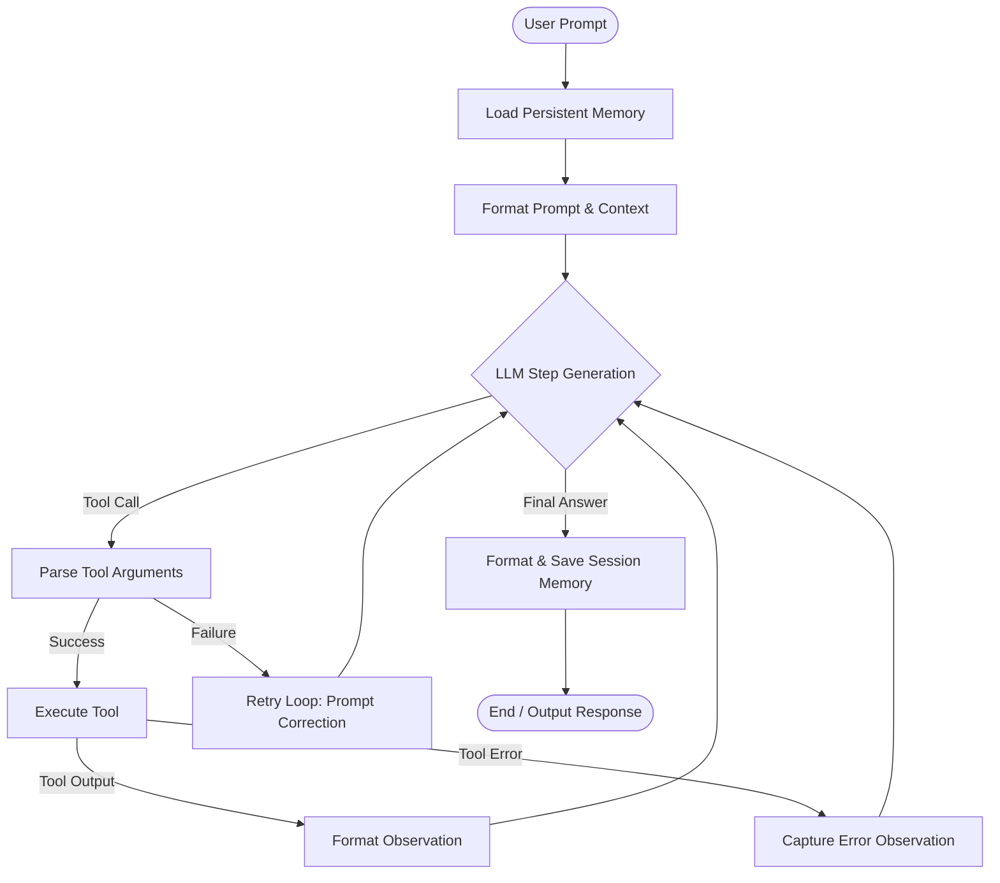

# Multi-Step AI Reasoning Agent (Python)

A production-grade, modular implementation of a multi-step AI reasoning agent from scratch. The agent operates using a cyclic **Reasoning -> Action -> Observation** loop (inspired by the ReAct pattern), executing custom Python tools, validating responses using Pydantic schemas, persisting session history, and gracefully recovering from failures.

## 🚀 Key Features

*   **Multi-Step Reasoning Loop**: The agent iteratively executes reasoning steps and runs tools to collect data before compiling a final user response.
*   **Dynamic Tool Use**: Custom local tools (calculator, note reader/writer, fact searching) are registered and executed programmatically based on the agent's decisions.
*   **Structured Output & Validation**: Output payloads are validated against strict JSON schemas defined by Pydantic models (`AgentStep`).
*   **Persistent Session Memory**: History and metadata are loaded from and saved to a local `memory.json` file, compressing context via LLM-driven session summarization.
*   **Failure Recovery & Resiliency**:
    *   **Parser Retries**: Detects and feeds JSON/schema violations back to the LLM to correct its output structure.
    *   **Tool Failures**: Intercepts tool execution errors and passes them back to the model as observations to encourage parameter correction.
    *   **API Rate-Limit Handling**: Catches 429 Quota Exceeded exceptions and automatically retries requests using exponential backoff.

---

## 🛠️ Architecture



---

## 📂 File Layout

*   [`config.py`](file:///d:/Antigravity%20Projects/multi-step-agent/config.py): Configuration loader (e.g. `GEMINI_API_KEY`).
*   [`schemas.py`](file:///d:/Antigravity%20Projects/multi-step-agent/schemas.py): Pydantic models for validated interaction steps (`AgentStep`) and long-term session states (`SessionState`).
*   [`memory.py`](file:///d:/Antigravity%20Projects/multi-step-agent/memory.py): Loading and saving logic for persistent JSON session data.
*   [`tools.py`](file:///d:/Antigravity%20Projects/multi-step-agent/tools.py): Custom tool functions and tool execution registry.
*   [`agent.py`](file:///d:/Antigravity%20Projects/multi-step-agent/agent.py): Core agent reasoning loop, retry-handling parser, and context summarizer.
*   [`main.py`](file:///d:/Antigravity%20Projects/multi-step-agent/main.py): Command Line Interface (CLI) wrapper for interactive session runs.
*   [`test_agent.py`](file:///d:/Antigravity%20Projects/multi-step-agent/test_agent.py): Programmatic end-to-end verification script.

---

## ⚙️ Installation & Setup

1. **Clone & Navigate**:
    ```bash
    cd multi-step-agent
    ```

2. **Set Up API Keys**:
    Create a `.env` file in the root directory:
    ```env
    GEMINI_API_KEY=your_gemini_api_key_here
    ```

3. **Install Dependencies**:
    ```bash
    pip install pydantic google-generativeai python-dotenv
    ```

---

## 💻 Usage

### Interactive CLI Shell
Run the main agent wrapper to start chatting:
```bash
python main.py
```
*   Type `status` to view the currently serialized session state.
*   Type `clear` to clean active history.
*   Type `exit` to trigger LLM-driven summarization, update memory, and save.

### Programmatic Verification Tests
Run the programmatic verification suite to test calculations, notes writing, rate limit handling, and session loading:
```bash
python test_agent.py
```
